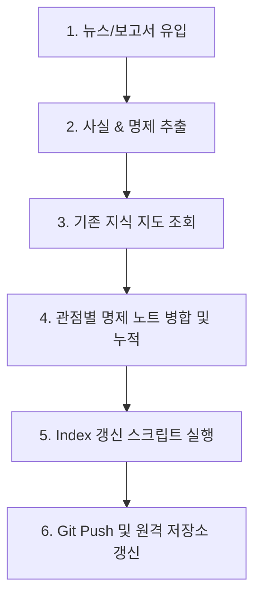

# ⚡ 분산에너지 지식 축적 저장소 (Distributed Energy Knowledge Base)

본 저장소는 분산에너지 활성화 특별법, 가상발전소(VPP), 에너지저장장치(ESS) 및 실시간 전력시장 등 분산에너지 도메인의 핵심 지식을 관점별로 분류하고 누적하기 위한 명제 기반 지식 베이스입니다.

---

## 🗺️ 지식 구조 및 지식 지도 (Index)

저장소의 지식은 네 가지 이해관계자 관점(국가, 사업자, 소비자, 정책기관)으로 수렴 및 통합되어 관리됩니다. 아래 Index 노트를 통해 전체 명제 현황을 일목요연하게 파악할 수 있습니다.

* **[🗺️ 분산에너지 관점별 지식 지도 (Index)](knowledge/README.md)** - 전체 관점의 핵심 요약 명제 제목과 팩트 개수를 한눈에 확인하는 마스터 인덱스입니다.
* **관점별 명제 노트**:
  - [국가 관점 지식 통합](knowledge/국가_관점.md)
  - [사업자 관점 지식 통합](knowledge/사업자_관점.md)
  - [소비자 관점 지식 통합](knowledge/소비자_관점.md)
  - [정책기관 관점 지식 통합](knowledge/정책기관_관점.md)

---

## 🛠️ 지식 누적 프로세스 및 동작 방식

본 저장소의 데이터는 다음과 같은 4단계 파이프라인을 거쳐 정밀하게 통합 및 업데이트됩니다.

### 1단계. 기사 분석 및 정보 추출
- 기사 및 보도자료 분석 시 [기사 분석 규칙](.agents/rules/analysis-style.md)에 따라 **사실 관계(Facts)**와 **명제(Propositions)**를 엄격히 분리하여 추출합니다.
- 사실 관계에는 시의성을 확보하기 위해 반드시 일자(`[YYYY-MM-DD]`)를 명시합니다.
- 명제는 핵심 주장이 직관적으로 드러나도록 **3~5개 내외의 주요 키워드로 구성된 요약 제목**으로 도출합니다. 만약 특정 관점에 대한 유의미한 정보가 없다면 해당 관점 분석은 과감히 생략합니다.

### 2단계. 지식 매핑 및 병합 (Dynamic Merge)
- 에이전트는 분석 결과가 나오면 기존 **지식 지도([knowledge/README.md](knowledge/README.md))**를 조회하여 축적 상태를 학습한 뒤, 해당 관점별 명제 노트([knowledge-style.md 규칙 참조](.agents/rules/knowledge-style.md))를 열어 병합합니다.
- **사실 관계 병합**: 기사에서 도출된 사실을 관점 노트 내의 유사한 정보 단위(그룹) 아래에 시간 순으로 병합 및 통합합니다.
- **명제 병합**: 유사한 명제들을 그룹화하여 짧은 제목 하단에 배치하며, 개정 또는 모순된 법안 등은 취소선(`~~`) 처리를 통해 지식의 역사를 보존합니다.

### 3단계. 인덱싱 자동화
- 지식 병합이 완료되면 파이썬 스크립트 `.agents/scripts/update_index.py`를 가동합니다.
- 본 스크립트는 정규식을 배제한 슬라이싱 및 문자열 파싱 기법으로 각 관점별 명제 노트를 파싱하여 `knowledge/README.md` (Index) 파일만을 안전하게 자동 갱신합니다.

---

## 📖 규칙 및 가이드라인 문서 목록
* [기사 분석 규칙](.agents/rules/analysis-style.md)
* [보고서 분석 규칙](.agents/rules/report-style.md)
* [지식 통합 및 누적 가이드라인](.agents/rules/knowledge-style.md)
* [표준 태그 규칙](.agents/rules/tags.md)
* [지식 누적 워크플로우](.agents/workflows/energy-analysis.md)
